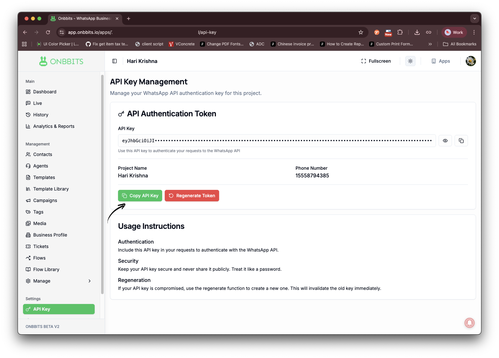
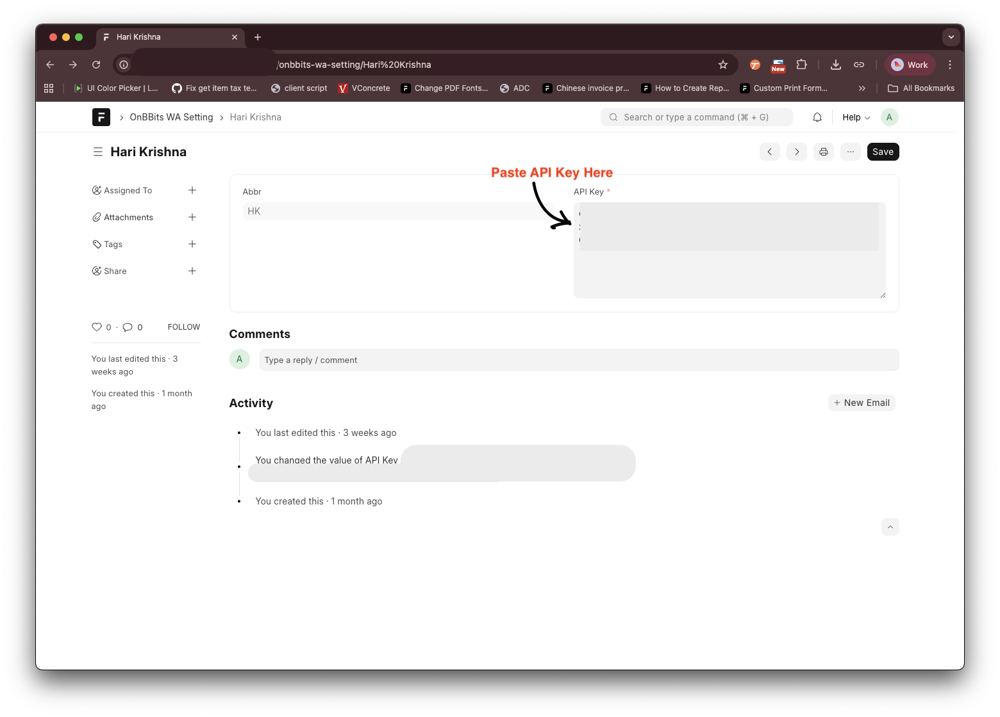
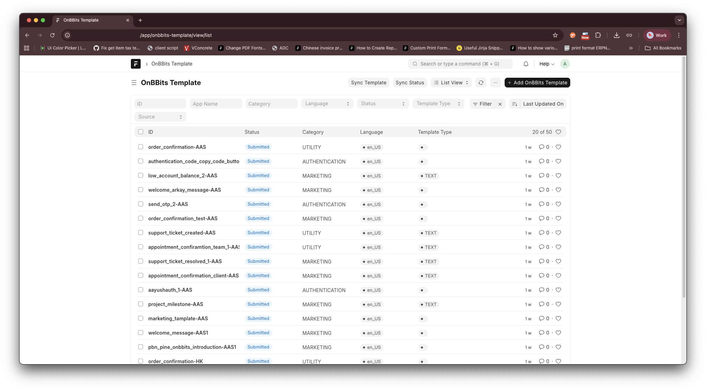
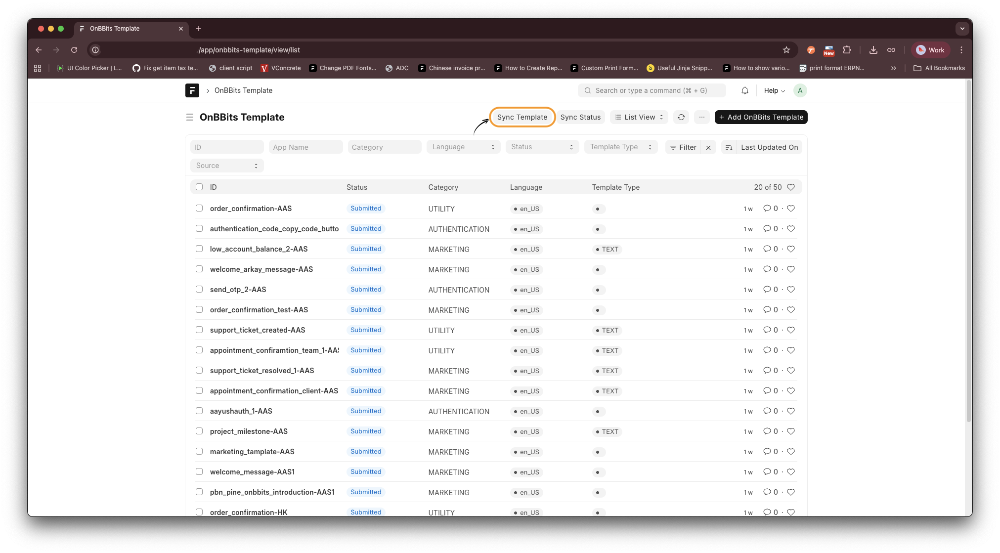
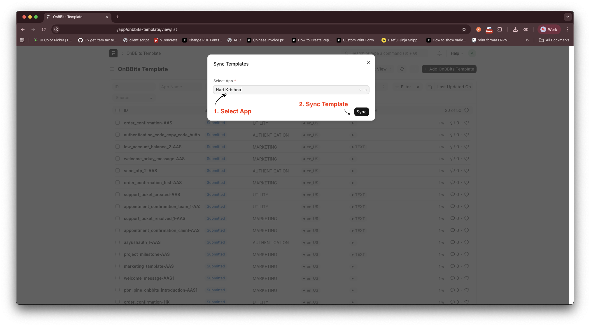
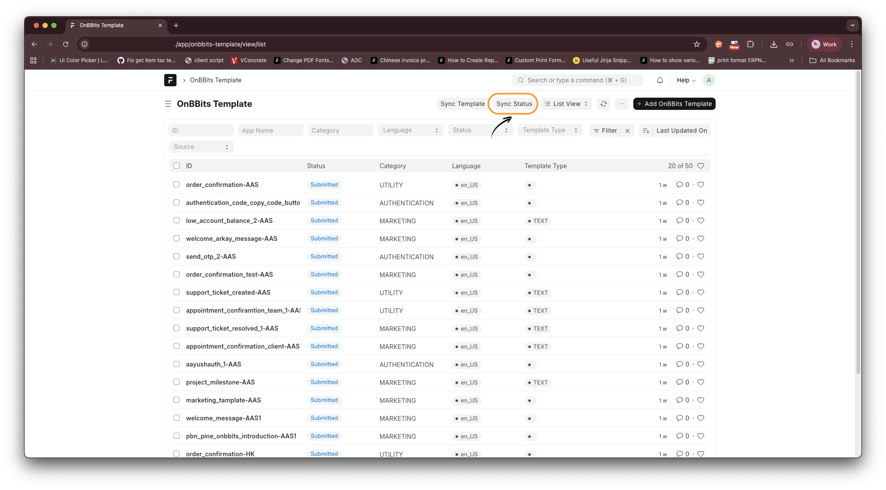
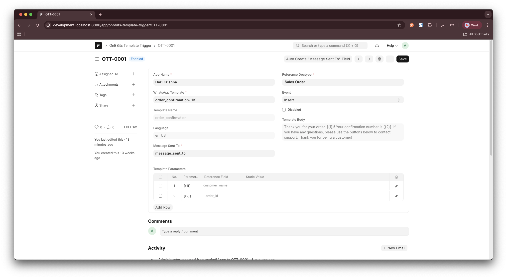

# OnBBits Integration

**OnBBits Integration** connects your Frappe / ERPNext system with the OnBBits WhatsApp Messaging Platform.
It enables automated WhatsApp messaging, template synchronization, and real-time communication directly from your ERP.

---

## Key Features

*  Seamless integration with OnBBits WhatsApp Platform
*  Template synchronization & status tracking
*  Automatic WhatsApp message triggers based on document events
*  Multi-app support
*  Secure API-based authentication

---

## Installation

Install using the Bench CLI:

```bash
cd $PATH_TO_YOUR_BENCH
bench get-app $URL_OF_THIS_REPO --branch develop
bench --site your-site-name install-app onbbits_integration
```

---

## Initial Setup

To start using the app, you need your **API Key** from the OnBBits portal.

---

### Step 1: Get API Key from OnBBits

1. Log in to your OnBBits account.
2. Open your App.
3. Locate **API Key** in the side navigation.
4. Copy the API Key.



---

### Step 2: Configure API Key in Frappe / ERPNext

1. Open your Frappe / ERPNext system.
2. Navigate to
   **OnBBits Integration → OnBBits WA Settings**
3. Paste the API Key.
4. Click **Save**.



💡 You can manage multiple OnBBits apps from the same settings screen.

---

## Managing WhatsApp Templates

Templates are predefined WhatsApp messages approved by Meta.

---

### Step 1: View Templates

Navigate to:

**OnBBits Templates**

Here you can see:

* Template Name
* Language
* Category
* Template Type
* Status (Approved / Pending)



---

### Step 2: Sync Templates

1. Click **Sync Templates**
2. Select the App
3. Templates will be fetched from OnBBits





Use this when:

* A new template is created
* Templates are updated
* Templates are missing in Frappe

---

### Step 3: Sync Template Status

Template status syncs automatically every 1 hour.

You can also sync manually:

1. Go to **WhatsApp Templates**
2. Click **Sync Status**



---

## Automatic Message Triggers

Automatically send WhatsApp messages when documents are created, updated, submitted, or cancelled.

---

## Create a Trigger Rule

1. Go to **WhatsApp Template Trigger**
2. Click **New**
3. Select:

   * App Name
   * DocType (e.g., Lead, Sales Order)
   * Event (Insert, Submit, Update, Cancel)
4. Choose **Message Sent To**

   * Select a Phone field
   * If none exists, click **Auto Create “Message Sent To” Field**
5. Select WhatsApp Template
6. Map Template Parameters:

### Parameter Mapping Options

*  **Reference Field**
  Map values from the document
  (e.g., customer_name, city, state)

*  **Static Value**
  Send fixed values
  (e.g., "12:00 PM")

7. Click **Save**



Mapped fields fetch data dynamically from the document.
Static values remain constant for every message.

---

## Quick Start Summary

1. Get API Key from OnBBits
2. Add API Key in WA Settings
3. Sync Templates
4. Create Trigger Rules
5. Start sending WhatsApp messages automatically

---

## Security

* Secure API authentication
* No WhatsApp credentials stored locally
* Controlled template-based messaging

---

## License

MIT
